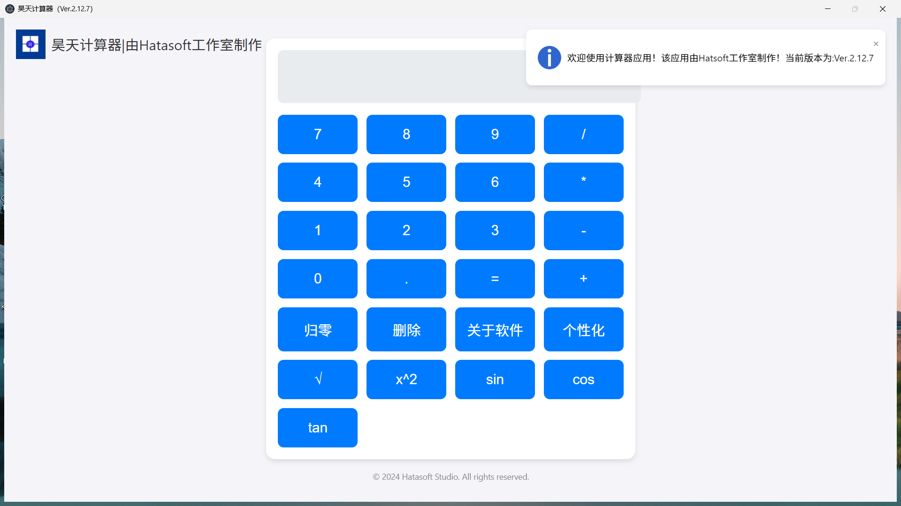
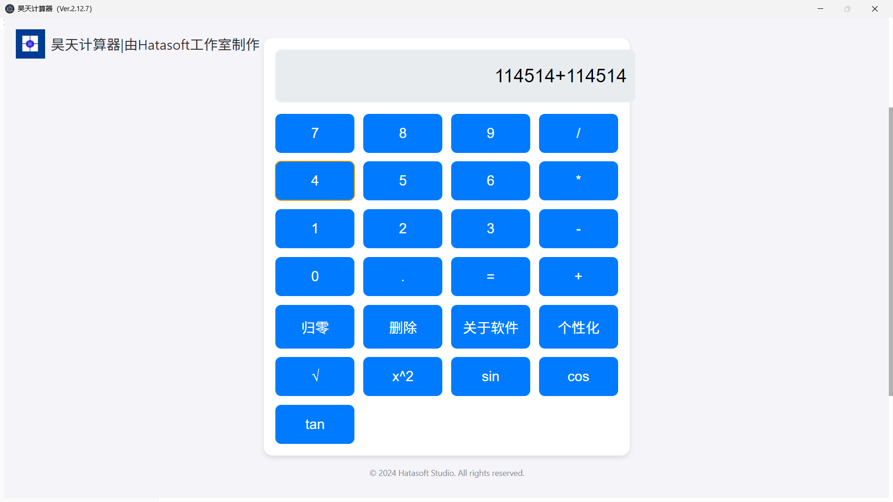
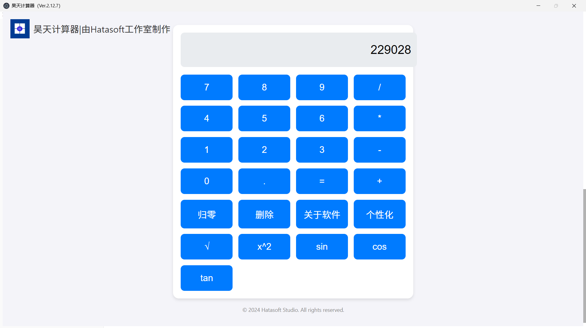
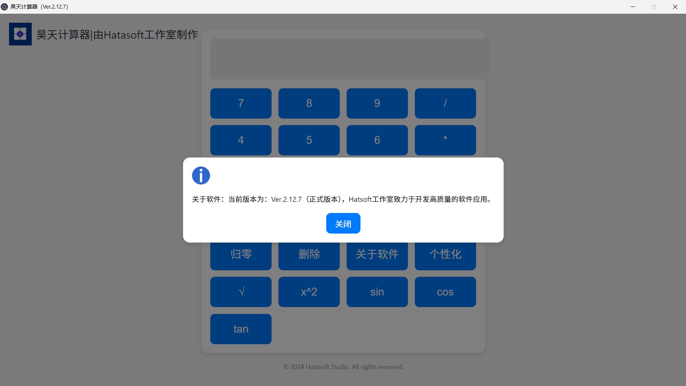
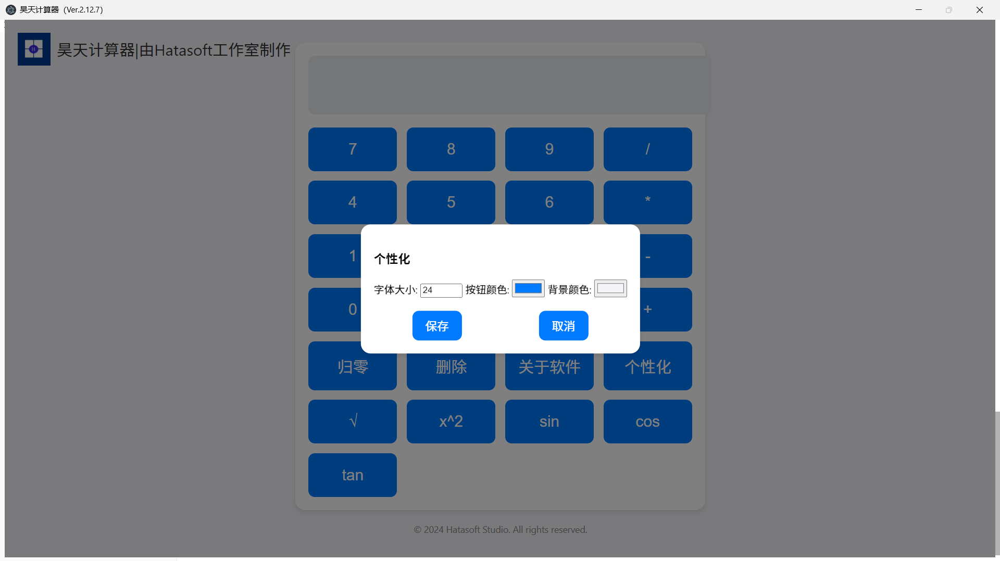

# Hatasoft Calculator2 For Windows

> [!WARNING]
>
> 如有任何bug或者是Readme文件内容有缺失的，请立即反馈，反馈方式：在本仓库的顶部导航栏选择Issues，提交Issue即可！
>
> 或者发送电子邮件给我们也行。
> 
> 本文件仅介绍Github版本的Hatasoft Calculator2！
>
> B站：Hatasoft工作室

##  产品介绍

**本产品用 Electron 和 Chromium 搭建！**

**我们专注于制作为大屏而生的程序**！

**并且我们还支持自定义它的按钮颜色以及它的 背景颜色！**

我们使用**Apache-2.0 license**，请各位自觉遵守！

## 产品截图

# 谢谢！

感谢你能翻到这儿！我们会继续努力，创作出更好的内容！

本文如果有任何问题，请发送邮件至 feedback@hatasoft365.top 递交反馈，也可以在GitHub上的Issues中提交反馈，我们会及时解决的！

# 版权

©Copyright 2025 Hatasoft工作室 版权所有

